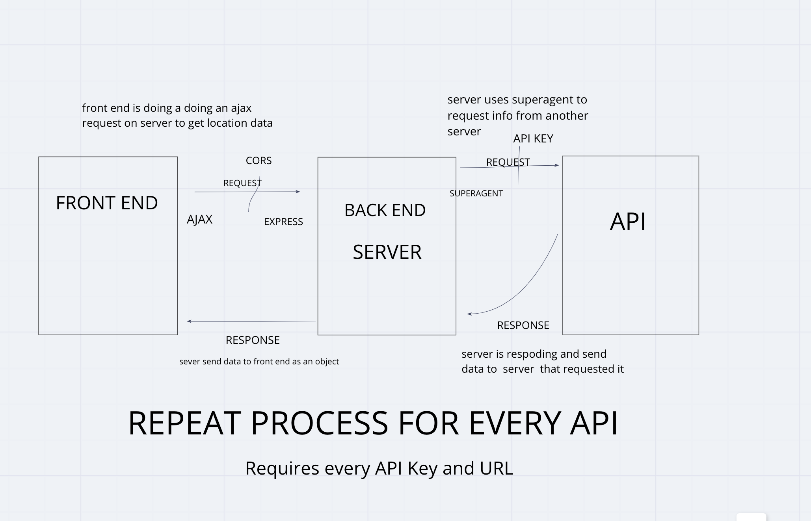

# city-explorer

## Lab06

#### Feature 1. repository set up

Estimate of time needed to complete: 30min

Start time: 1:30pm

Finish time: 2:10pm

Actual time needed to complete: 40 min

#### Feature 2. Locations- As a user of City Explorer, I want to enter the name of a location so that I can see data about the area of interest to me.

Estimate of time needed to complete: 1:30

Start time: 2:45pm

Finish time: 3:42pm

Actual time needed to complete: 1hours

#### Feature 3. Weather: As a user, I want to request current weather information so that I can learn more about the typical weather patterns in the location I had entered.

Estimate of time needed to complete: 1:30

Start time: 3:45pm

Finish time: 4:40

Actual time needed to complete: 55min

#### Feature 4. Errors: As a user, I want clear messages if something goes wrong so I know if I need to make any changes or try again in a different manner.

Estimate of time needed to complete: 45min

Start time: 4:45pm

Finish time: 5:00pm

Actual time needed to complete: 15min

## Lab07

#### Feature 1. Data formatting: As a user, I want the application to provide properly formatted data so that I can view similar data for any location I choose.

Estimate of time needed to complete: 1hour

Start time: 1:30

Finish time: 3:30

Actual time needed to complete: 3hours

#### Feature 2. Locations: As a user, I want to enter the name of a location so that I do not need to look up the latitude and longitude every time I learn about a new location.

Estimate of time needed to complete: 30 min

Start time: 3:30

Finish time: 3:50

Actual time needed to complete: 20min

#### Feature 3. Weather: As a user, I want to request current weather information at any location, so that I can learn more about the typical weather patterns in the area of interest.

Estimate of time needed to complete: 30 min

Start time: 3:50

Finish time: 4:20

Actual time needed to complete: 30min

#### Feature 4. Trails: As a user, I want to request information about trails and campgrounds in the area so that users can explore the location.

Estimate of time needed to complete: 1hour

Start time: 4:20

Finish time: 5:15

Actual time needed to complete: 1 hour

# Project Name

**Author**: Lulu Sevignon
**Version**: 1.0.0 (increment the patch/fix version number if you make more commits past your first submission)

## Overview
<!-- Provide a high level overview of what this application is and why you are building it, beyond the fact that it's an assignment for this class. (i.e. What's your problem domain?) -->

 As a user of City Explorer, I want to enter the name of a location so that I can see data about the area of interest to me.
 As a user, I want to request current weather information so that I can learn more about the typical weather patterns in the location I had entered.
 As a user, I want clear messages if something goes wrong so I know if I need to make any changes or try again in a different manner.

## Getting Started
<!-- What are the steps that a user must take in order to build this app on their own machine and get it running? -->

## Architecture
<!-- Provide a detailed description of the application design. What technologies (languages, libraries, etc) you're using, and any other relevant design information. -->

JavaScript

## Change Log
<!-- Use this area to document the iterative changes made to your application as each feature is successfully implemented. Use time stamps. Here's an examples:

01-01-2001 4:59pm - Application now has a fully-functional express server, with a GET route for the location resource. -->

## Credits and Collaborations
<!-- Give credit (and a link) to other people or resources that helped you build this application.-->
I worked with Courtney and Marta on Lab 06
I worked with Chirs and Michael on Lab 07